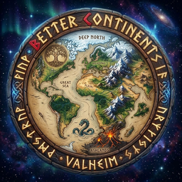

# 🗺️ Better Continents

> *"The Allfather did not carve the Tenth Realm in a single stroke. With hammer and chisel, the jagged peaks were raised, deep fjords torn open, and ancient oceans poured into the abyss. Take up the chisel, Viking, and shape the continents to your will."*

**Better Continents** is a total procedural and bitmap overhaul of Valheim's world generation. It gives world builders, server administrators, and cartographers complete control over terrain generation—allowing you to replace or augment vanilla landmasses with custom heightmaps, bespoke biome layouts, precision spawn placements, and intricate multi-layered noise. 

Whether you want to import a real-world map of Earth, recreate Middle-earth, sculpt realistic mountain ranges, or carve an unforgiving archipelago for a hardcore survival campaign, Better Continents makes it possible.

📜 <b>Contents</b>

- [⚔️ Core Features](#core-features)
  - [🏔️ Precision Heightmap Layers](#precision-heightmap-layers)
  - [🌿 Handcrafted Biome Layouts](#handcrafted-biome-layouts)
  - [🌲 Custom Forest Coverage](#custom-forest-coverage)
  - [📍 Absolute Location & Spawn Control](#absolute-location--spawn-control)
  - [🌊 Global Ocean & Continent Scaling](#global-ocean--continent-scaling)
  - [⚡ Multi-Layer FastNoiseLite Procedural Engine](#multi-layer-fastnoiselite-procedural-engine)
  - [🎨 In-Game World Architect UI](#in-game-world-architect-ui)
  - [💾 World File Sharing & Presets](#world-file-sharing--presets)
- [📦 Recommended Companion Mods](#recommended-companion-mods)
- [🍗 Installation & Setup](#installation--setup)
- [🛠️ How World Generation Works](#how-world-generation-works)
  - [🗺️ Image Map Specifications](#image-map-specifications)
  - [📡 Sharing Maps With Players](#sharing-maps-with-players)
- [⚙️ Configuration & Console Commands](#configuration--console-commands)
- [📚 Documentation & Guides](#documentation--guides)
- [📜 Credits & History](#credits--history)

> 🔗 Looking for seamless travel across your custom continents? Check out [TortalPortal](https://valheim.hexium.gg/mods/Wubarrk/TortalPortal) on Hexium!

---

## ⚔️ Core Features

### 🏔️ Precision Heightmap Layers
Shape mountains, cliffs, and ocean trenches using standard grayscale or RGB image files.
* 🌐 **Base Heightmap:** Sets the continental foundation and sea level contours ([Guide](https://jerekuusela.github.io/BetterContinents-Docs/settings/heightmap.html)).
* 🌊 **Detail Heightmap:** Adds fine-grained localized ridges, valleys, and coastal erosion ([Guide](https://jerekuusela.github.io/BetterContinents-Docs/settings/flatmap.html)).
* ⛰️ **Rough Heightmap:** Biome-specific height noise blended seamlessly with vanilla terrain ([Guide](https://jerekuusela.github.io/BetterContinents-Docs/settings/roughmap.html)).
* 🎛️ **Blend Modes:** Supports customizable blending operations including Add, Multiply, Maximum, Minimum, and Masked blending.

### 🌿 Handcrafted Biome Layouts
Forget vanilla's rigid concentric circles. Draw your world's biomes by painting a simple image map ([Biome Map Guide](https://jerekuusela.github.io/BetterContinents-Docs/settings/biomemap.html)):
* 🎨 Assign specific color keys to Meadows, Black Forest, Swamp, Mountain, Plains, Mistlands, Ashlands, and Deep North.
* 🏝️ Paint custom islands dedicated entirely to specific biomes, or craft seamless, realistic climate transitions.

### 🌲 Custom Forest Coverage
Take direct control over tree density and clearings across the realm ([Forest Guide](https://jerekuusela.github.io/BetterContinents-Docs/settings/forest.html)):
* 🪓 Specify forest density maps, creating massive open tundra clearings in the Black Forest or thick ancient woods across the Plains.
* 🌲 Override tree generation even in biomes that are normally 100% forested (Swamps, Mistlands, Mountains).

### 📍 Absolute Location & Spawn Control
Dictate where history begins on your world ([Spawn Map Guide](https://jerekuusela.github.io/BetterContinents-Docs/settings/spawnmap.html)):
* ⛩️ **Starting Temple:** Pinpoint the exact coordinates of the sacrificial stones and player spawn ([Start Position Guide](https://jerekuusela.github.io/BetterContinents-Docs/settings/start-position.html)).
* 💀 **Boss Altars:** Place Eikthyr, The Elder, Bonemass, Moder, Yagluth, and the Queen exactly where your design intends.
* 💰 **Traders & Dungeons:** Place Haldor, Hildir, and crypts on designated islands or mountain peaks.

### 🌊 Global Ocean & Continent Scaling
* 🌊 **Sea Level Adjustment:** Dynamically raise sea level to drown lowland continents into island archipelagos, or lower it to expose vast continental land bridges ([Global Settings Guide](https://jerekuusela.github.io/BetterContinents-Docs/settings/global.html)).
* 🗺️ **Continent Size Scaling:** Scale continent frequency and landmass size independently without breaking seed coherence.

### ⚡ Multi-Layer FastNoiseLite Procedural Engine
Under the hood, Better Continents integrates a high-performance [FastNoiseLite](https://github.com/Auburn/FastNoiseLite) layer system:
* 🧩 Stack unlimited noise layers (Perlin, Simplex, Cellular/Voronoi, Value).
* 🎚️ Apply independent frequencies, fractal octaves, domain warping, and masking to each layer.

### 🎨 In-Game World Architect UI
* 🖥️ Design, preview, and adjust your world directly inside Valheim.
* 👁️ Interactive visual editor shows layer stacking, real-time height visualization, and immediate terrain regeneration.

### 💾 World File Sharing & Presets
* 📁 Worlds generated with Better Continents save alongside a companion `.BetterContinents` configuration file.
* 🤝 Anyone with the mod can load and explore your shared world identically—no external dependencies or complex editors needed.

---

## 📦 Recommended Companion Mods

To get the absolute most out of Better Continents, we strongly recommend pairing it with:

* 🛠️ **[Server Devcommands](https://valheim.hexium.gg/mods/JereKuusela/Server_devcommands)** — Unlocks administrative flying, god mode, and unlimited camera exploration while testing and designing your custom worlds.
* 🌍 **[Upgrade World](https://valheim.thunderstore.io/package/JereKuusela/Upgrade_World/)** — Essential for resetting zones, forcing location spawns (`location_register`), and regenerating modified map sectors on the fly.
* 🔨 **[Infinity Hammer](https://valheim.hexium.gg/mods/JereKuusela/Infinity_Hammer)** — Perfect for building custom ruins, landmarks, and settlements directly into your handcrafted terrain.
* 🌀 **[TortalPortal](https://valheim.hexium.gg/mods/Wubarrk/TortalPortal)** — The ultimate portal overhaul with destination previews, favorites, and server synchronization across massive continents.

---

## 🍗 Installation & Setup

### ⚡ Automated Installation (Recommended)
Install using **Gale** or your preferred mod manager directly from [Hexium](https://valheim.hexium.gg/mods/JereKuusela/BetterContinents).

### 🛠️ Manual Installation
1. Ensure **BepInEx for Valheim** is properly installed in your game directory.
2. Download the latest `BetterContinents.dll` release.
3. Place `BetterContinents.dll` into your `Valheim/BepInEx/plugins/` directory.
4. Dedicated servers running custom maps must have Better Continents installed and the companion `.BetterContinents` world file placed in the `worlds_local/` directory.

---

## 🛠️ How World Generation Works

### 🗺️ Image Map Specifications
Better Continents uses standard image files (PNG recommended) placed in your world configuration folder:
* 📏 **Resolution:** 2048×2048 or 4096×4096 square images provide excellent fidelity for the full Valheim world disc.
* ⚪ **Heightmaps:** Grayscale 8-bit or 16-bit PNG. Pure black (`#000000`) is maximum ocean depth; pure white (`#FFFFFF`) is the highest mountain summit.
* 🎨 **Biome Maps:** RGB PNG where distinct color codes correspond to each biome type.
* 🌳 **Forest Maps:** Grayscale PNG where white denotes maximum tree density and black denotes open clearings.

### 📡 Sharing Maps With Players
When you create a world with Better Continents:
1. Valheim creates the standard `.db` and `.fwl` world files in your `worlds_local` directory.
2. Better Continents automatically creates a companion `<WorldName>.BetterContinents` file in the same directory.
3. To share your world with players or a dedicated server, simply copy all three files:
   - `<WorldName>.fwl`
   - `<WorldName>.db`
   - `<WorldName>.BetterContinents`

---

## ⚙️ Configuration & Console Commands

Better Continents provides extensive console commands for real-time map design:

* ⌨️ `bc_ui` — Toggles the in-game world generation editor UI.
* ⌨️ `bc_export [resolution]` — Exports the current world map to a full-resolution PNG image file.
* ⌨️ `bc_reload` — Reloads image maps from disk without restarting the game.
* ⌨️ `bc_info` — Displays active heightmap and noise layer settings for the current world.

---

## 📚 Documentation & Guides

For deep dives, tutorials, and configuration references:
* 📖 [Full Documentation](https://jerekuusela.github.io/BetterContinents-Docs/introduction.html)
* 🚀 [Setup & Quick Start Guide](https://jerekuusela.github.io/BetterContinents-Docs/setup-guide.html)
* ❓ [Frequently Asked Questions (FAQ)](https://jerekuusela.github.io/BetterContinents-Docs/faq.html)
* 💬 [Community Discord Server](https://discord.gg/3XW8ZntYzN)

---

## 📜 Credits & History

* 👑 Originally created by **billw2012** — the pioneer of Valheim heightmap and custom continent generation.
* 🛠️ Maintained and expanded by **JereKuusela**.
* ⚡ Modernized for Valheim 1.0 by **Wubarrk**.
